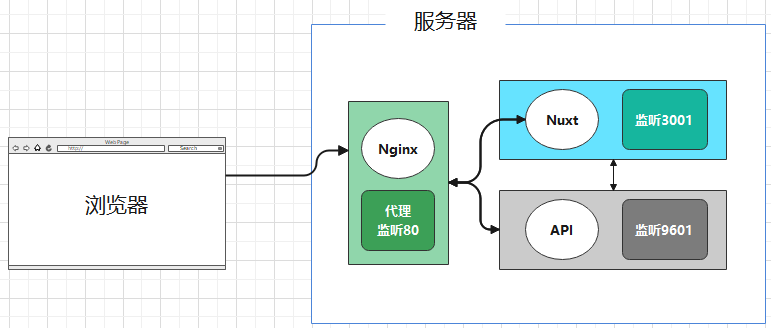

# 线上视频课程学习系统


## 1. 系统介绍

* 在线学习管理系统，核心功能为课程管理及课程视频学习，其他包括
* 建立多个前端项目，实现多终端使用（PC Web、Mobile、小程序）
* **详细使用请见** [**操作手册**](https://github.com/enqiangjing/study-online-web/blob/main/options.md)

### 1.1部署架构

基于 Nginx 代理，前后端独立部署




## 2. 项目工程

### 2.1 前端页面（基于 Nuxt.js）
```shell
git clone git@github.com:enqiangjing/study-online-web.git
```
### 2.2 后端API（基于 SpringBoot）
```shell
git clone git@github.com:enqiangjing/study-online-api.git
```
### 2.3 项目介绍（本地址）
```shell
git clone git@github.com:enqiangjing/study-online.git
```


## * 免责声明
* 本项目所有内容仅供参考和学习交流使用。
* 项目所存在的风险将由使用者自行承担，因使用本项目而产生的一切后果也由使用者自己承担。
* 凡以任何方式直接、间接使用本项目的人员，视为自愿接受本项目声明和法律法规的约束。